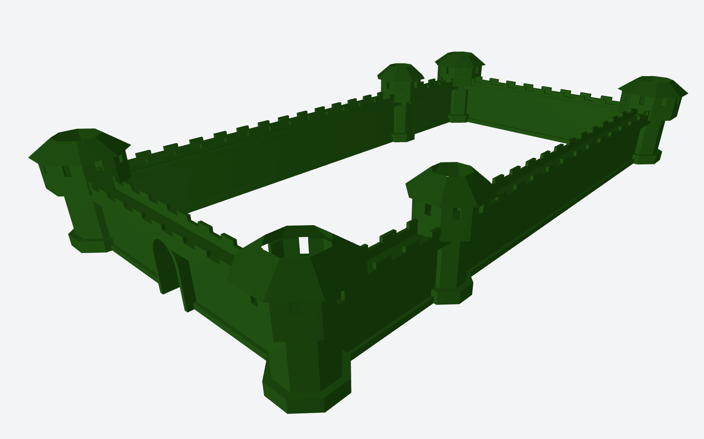

# CSG Builder

A TypeScript-based 3D mesh creation tool using a component-based architecture. Build complex 3D models programmatically and export them as STL files.

## Overview

CSG Builder allows you to create 3D meshes using TypeScript code with a React-like component pattern. It leverages Constructive Solid Geometry (CSG) operations to combine, subtract, and transform primitive shapes (cubes, cylinders, spheres, cones, and polygon prisms) into complex geometries.

## Features

- **Component-Based Architecture** - Define reusable 3D components as TypeScript functions
- **Primitive Shapes** - Cubes, cylinders, spheres, cones, and polygon prisms with customizable dimensions
- **Custom Profile Prisms** - Extrude 2D profiles into 3D shapes using points, paths, or Shape API
- **Body of Revolution** - Create rotationally symmetric objects (chess pieces, vases, bottles) by rotating profiles
- **Partial Geometries** - Create pie slices, hemispheres, and wedges with CSG-based angle cutting
- **Static CSG Operations** - Immutable SUBTRACT, UNION, INTERSECT, and MERGE operations for complex geometries
- **Grid Arrays** - Create 1D, 2D, and 3D arrays with static GRID_X, GRID_XY, GRID_XYZ methods
- **Transformations** - Translate, rotate, and scale objects with chainable methods
- **Real-Time Preview** - Interactive 3D viewport with orbit controls
- **STL Export** - Export models in binary STL format for 3D printing
- **Hot Reload** - Instant updates during development with simple browser refresh (Ctrl+R)
- **Full Examples** - See how to use all features in the included examples by running the app and exploring the dropdown

## Examples STLs

[Whole castle](./STLs/Castle.stl)

[Brick Wall with Window](./STLs/BrickWallwithWindow.stl)

[L Profile With Holes](./STLs/LProfileWithHoles.stl)

[Connector Tower 10](./STLs/ConnectorTower10.stl)



## Tech Stack

- **TypeScript** - Type-safe component definitions
- **Three.js** - 3D rendering engine
- **three-bvh-csg** - High-performance CSG operations
- **Svelte 5** - Reactive UI framework
- **Threlte** - Svelte wrapper for Three.js
- **Vite** - Fast build tool and dev server
- **Tailwind CSS** - Utility-first styling

## Prerequisites

- Node.js >= 22.0.0
- npm >= 10.0.0

## Installation

```bash
npm install
```

## Development

Start the development server:

```bash
npm run dev
```

The application will be available at `http://localhost:5173`

**Note on Deployment:**

- Build output goes to `./docs` directory

## Usage

### Quick Start

1. Create a new file in `projects/[your-project]/` directory
2. Define your 3D component using the Solid class
3. Export a components map
4. Register your components in the project index
5. View and export your model in the browser

### Example: Simple Box

```typescript
import { Solid } from '$lib/3d/Solid';
import type { ComponentsMap } from '$stores/componentStore';

export const simpleBox = (): Solid => {
	return Solid.cube(10, 10, 10, 'blue');
};

export const components: ComponentsMap = {
	SimpleBox: () => simpleBox()
};
```

### Example: Complex Component

```typescript
import { Solid } from '$lib/3d/Solid';
import type { ComponentsMap } from '$stores/componentStore';

export const hollowBox = (): Solid => {
	// Create outer box
	const outer = Solid.cube(20, 20, 20, 'red');

	// Create inner box and subtract it
	const inner = Solid.cube(16, 16, 16, 'red');

	// Static CSG subtraction (immutable)
	return Solid.SUBTRACT(outer, inner);
};

export const boxWithHoles = (): Solid => {
	const box = Solid.cube(20, 20, 20, 'blue');

	// Create holes using static SUBTRACT
	const holeX = Solid.cylinder(3, 25, { color: 'blue' }).rotate({ z: 90 });
	const holeY = Solid.cylinder(3, 25, { color: 'blue' });
	const holeZ = Solid.cylinder(3, 25, { color: 'blue' }).rotate({ x: 90 });

	return Solid.SUBTRACT(box, holeX, holeY, holeZ);
};

export const components: ComponentsMap = {
	HollowBox: () => hollowBox(),
	BoxWithHoles: () => boxWithHoles()
};
```

### Example: Reusable Component with Negative Solids

```typescript
// Window that can be placed in any wall and will cut through it
export const window = (width: number, height: number, depth: number): Solid => {
	const frame = Solid.cube(width, height, depth, 'brown');

	// Mark opening as negative - it will be subtracted during MERGE
	const opening = Solid.cube(width - 4, height - 4, depth * 4, 'gray').setNegative();

	const bar = Solid.cube(2, height, depth - 1, 'brown').move({ z: -0.5 });

	// MERGE respects negative flags: frame + opening (subtracted) + bar
	return Solid.MERGE([frame, opening, bar]);
};

// Usage in wall
export const wallWithWindow = (): Solid => {
	const wall = Solid.cube(20, 20, 1, 'gray');
	const win = window(5, 8, 3).move({ x: 10, y: 5 }); // Use move for relative positioning

	// Window's negative opening is already processed in MERGE
	return Solid.UNION(wall, win);
};
```

### Example: Using New Primitive Shapes

```typescript
import { Solid } from '$lib/3d/Solid';

// Sphere - perfect for rounded features
export const roundedCorner = (): Solid => {
	const cube = Solid.cube(20, 20, 20, 'red');
	const corner = Solid.sphere(3, { color: 'red' }).move({ x: 10, y: 10, z: 10 });
	return Solid.SUBTRACT(cube, corner); // Rounded corner via subtraction
};

// Cone - great for tapers and chamfers
export const chamferedEdge = (): Solid => {
	const block = Solid.cube(15, 15, 15, 'blue');
	const chamfer = Solid.cone(4, 8, { color: 'blue' }).rotate({ x: 90 }).move({ z: 7.5 });
	return Solid.SUBTRACT(block, chamfer);
};

// Prism - N-sided shapes (hexagon, octagon, etc.)
export const hexNut = (): Solid => {
	const outer = Solid.prism(6, 10, 5, { color: 'gray' }); // 6 sides = hexagon
	const hole = Solid.cylinder(4, 6, { color: 'gray' });
	return Solid.SUBTRACT(outer, hole).center();
};

// Triangle Prism - 3-sided prism
export const roof = (): Solid => {
	return Solid.trianglePrism(8, 20, { color: 'brown' }).rotate({ z: 90 }).align('bottom');
};

// Combining multiple new primitives
export const shapesComposition = (): Solid => {
	const base = Solid.cube(20, 4, 20, 'teal').align('bottom');
	const sphere = Solid.sphere(8, { color: 'teal' }).move({ y: 10 });
	const cone = Solid.cone(5, 10, { color: 'teal' }).move({ y: 18 });

	return Solid.UNION(base, sphere, cone).center({ x: true, z: true });
};

// Partial geometries - closed, manifold shapes via CSG cutting
export const pieSlice = (): Solid => {
	// Quarter cylinder (90° pie slice)
	return Solid.cylinder(10, 2, {
		color: 'red',
		angle: Solid.DEG_90
	}).align('bottom');
};

export const hemisphere = (): Solid => {
	// Half sphere (180°)
	return Solid.sphere(8, {
		color: 'cyan',
		angle: Solid.DEG_180
	});
};

export const coneWedge = (): Solid => {
	// Half cone wedge (180°)
	return Solid.cone(8, 12, {
		color: 'orange',
		angle: Solid.DEG_180
	}).align('bottom');
};

export const partialGear = (): Solid => {
	// Three-quarter octagonal prism (270°) - gear-like shape
	const outer = Solid.prism(8, 10, 4, {
		color: 'silver',
		angle: Solid.DEG_270
	});
	const hole = Solid.cylinder(5, 5, { color: 'silver' });

	return Solid.SUBTRACT(outer, hole).align('bottom');
};

export const pieChart = (): Solid => {
	// Composite: three 90° slices rotated to form a pie chart
	const slice1 = Solid.cylinder(10, 2, { color: 'red', angle: 90 });
	const slice2 = Solid.cylinder(10, 2, { color: 'blue', angle: 90 }).rotate({ y: 90 });
	const slice3 = Solid.cylinder(10, 2, { color: 'green', angle: 90 }).rotate({ y: 180 });

	return Solid.UNION(slice1, slice2, slice3).align('bottom');
};
```

### Example: Custom Profile Prisms

Create complex 2D profiles and extrude them into 3D shapes. Three approaches available:

```typescript
import { Solid, straight, curve } from '$lib/3d/Solid';

// 1. SHAPE BUILDER API - Full control with Three.js Shape methods
export const lBracket = (): Solid => {
	return Solid.profilePrism(
		10,
		(shape) => {
			shape.moveTo(0, 0);
			shape.lineTo(20, 0);
			shape.lineTo(20, 5);
			shape.lineTo(5, 5);
			shape.lineTo(5, 20);
			shape.lineTo(0, 20);
			// Auto-closes to starting point
		},
		'blue'
	);
};

// 2. POINT ARRAY - Simple coordinate-based profiles
export const trapezoid = (): Solid => {
	return Solid.profilePrismFromPoints(
		8,
		[
			[0, 0], // Start point
			[10, 0], // Bottom right
			[8, 5], // Top right
			[2, 5] // Top left
			// Automatically closes back to [0, 0]
		],
		'red'
	);
};

// 3. PATH SEGMENTS - Smooth curves and controlled turns (NEW!)
export const roundedRectangle = (): Solid => {
	return Solid.profilePrismFromPath(
		5,
		[
			straight(20), // Bottom edge
			curve(5, 90), // Right turn with radius 5
			straight(10), // Right edge
			curve(5, 90), // Top-right corner
			straight(20), // Top edge
			curve(5, 90), // Top-left corner
			straight(10), // Left edge
			curve(5, 90) // Bottom-left corner
			// Automatically closes back to origin
		],
		'blue'
	);
};

// Path segments support smooth curves and sharp corners
export const sCurve = (): Solid => {
	return Solid.profilePrismFromPath(
		6,
		[
			straight(10), // Start with straight
			curve(5, 90), // Right turn (positive angle)
			straight(8), // Middle section
			curve(5, -90), // Left turn (negative angle)
			straight(10) // Final straight
		],
		'green'
	);
};

// Sharp corners using zero-radius curves
export const triangle = (): Solid => {
	return Solid.profilePrismFromPath(
		4,
		[
			straight(15),
			curve(0, 120), // Sharp 120° corner (no rounding)
			straight(15),
			curve(0, 120), // Sharp corner
			straight(15),
			curve(0, 120) // Sharp corner to close
		],
		'orange'
	);
};

// Oval/race track shape
export const raceTrack = (): Solid => {
	return Solid.profilePrismFromPath(
		3,
		[
			straight(30), // Straightaway
			curve(8, 180), // Semicircle turn
			straight(30), // Back straightaway
			curve(8, 180) // Return semicircle
		],
		'purple'
	).center();
};
```

**Path Segment Features:**

- `straight(length)` - Straight line segment
- `curve(radius, angle)` - Curved arc segment
  - Positive angle = right turn (clockwise)
  - Negative angle = left turn (counter-clockwise)
  - Zero radius = sharp corner (no rounding)
- Path starts at origin (0, 0) facing right (+X)
- Each segment continues from previous endpoint
- Automatically closes back to origin

### Example: Body of Revolution (Lathe Geometry)

Create rotationally symmetric objects like chess pieces, vases, and bottles by rotating a 2D profile around the Y-axis:

```typescript
import { Solid, straight, curve } from '$lib/3d/Solid';

// 1. SHAPE BUILDER API - Full control with Three.js Shape methods
export const vase = (): Solid => {
	return Solid.revolutionSolid(
		(shape) => {
			shape.moveTo(5, 0); // Bottom radius (x = radius, y = height)
			shape.lineTo(3, 5); // Narrow middle
			shape.lineTo(6, 10); // Wide top
			shape.lineTo(5, 15); // Rim
			shape.lineTo(0, 15); // Back to center
		},
		{ color: 'blue' }
	);
};

// 2. POINT ARRAY - Simple coordinate-based profiles
export const chessPawn = (): Solid => {
	return Solid.revolutionSolidFromPoints(
		[
			[0, 0], // Bottom center (x = radius, y = height)
			[3, 0], // Bottom edge
			[2, 2], // Narrow stem
			[4, 8], // Body
			[2, 10], // Neck
			[3, 12], // Head
			[0, 12] // Top center
		],
		{ color: 'white' }
	);
};

// 3. PATH SEGMENTS - Smooth curves and controlled turns
export const bottle = (): Solid => {
	return Solid.revolutionSolidFromPath(
		[
			straight(5), // Bottom radius
			curve(2, 90), // Rounded corner up
			straight(8), // Body height
			curve(3, -90), // Curve inward for neck
			straight(5), // Neck height
			curve(1, -90), // Top curve
			straight(2) // Rim width
		],
		{ color: 'green' }
	);
};

// Sharp corners using zero-radius curves
export const chessRook = (): Solid => {
	return Solid.revolutionSolidFromPath(
		[
			straight(4), // Base radius
			curve(0, 90), // Sharp corner up (zero radius = sharp)
			straight(10), // Tower height
			curve(0, -90), // Sharp corner outward
			straight(1), // Battlement step
			curve(0, 90), // Sharp corner up
			straight(1.5), // Battlement height
			curve(0, 180), // Turn back
			straight(1.5), // Down
			curve(0, 90), // Corner
			straight(1) // To center
		],
		{ color: 'black' }
	);
};

// Partial revolution - cut-away views
export const quarterVase = (): Solid => {
	return Solid.revolutionSolidFromPoints(
		[
			[0, 0],
			[4, 0],
			[3, 2],
			[5, 6],
			[4, 10],
			[0, 10]
		],
		{
			angle: Solid.DEG_90, // 90° slice
			color: 'purple'
		}
	);
};

// Half revolution for cross-sections
export const halfBottle = (): Solid => {
	return Solid.revolutionSolidFromPath(
		[straight(5), curve(2, 90), straight(10), curve(3, 90), straight(3)],
		{
			angle: Solid.DEG_180, // 180° half
			color: 'cyan'
		}
	);
};
```

**Revolution Profile Coordinate System:**

- **X-axis** = Radius from center (distance from Y-axis)
- **Y-axis** = Height (vertical position)
- Profile is rotated around the Y-axis
- Start at origin (0, 0) or close to the Y-axis for proper revolution
- Points with X=0 will be at the center axis

**Common Use Cases:**

- Chess pieces (pawn, rook, bishop, queen, king)
- Tableware (vases, bottles, goblets, wine glasses, bowls)
- Architectural elements (balusters, columns, finials)
- Mechanical parts (knobs, handles, pulleys)
- Decorative objects (candlesticks, lamp bases, ornaments)

## Performance Optimization

For expensive component computations that are called repeatedly with the same parameters, CSG Builder provides caching utilities to improve performance.

### Caching Functions

The caching system (`src/lib/cacheFunction.ts`) provides two wrapper functions to cache component results:

#### Named Function Caching

Use `cacheFunction` to wrap named functions that return `Solid`:

```typescript
import { cacheFunction } from '$lib/cacheFunction';

// Original function
const expensiveWall = (length: number, height: number): Solid => {
	// Complex CSG operations...
	const wall = Solid.cube(length, height, 2, 'gray');
	const windows = Solid.cube(5, 8, 3, 'gray');
	return Solid.SUBTRACT(wall, windows);
};

// Wrap with cache
const cachedWall = cacheFunction(expensiveWall);

// Usage: First call computes, subsequent calls with same params return cached result
const wall1 = cachedWall(100, 20); // Computes and caches result
const wall2 = cachedWall(100, 20); // Returns cached result (instant)
const wall3 = cachedWall(150, 25); // Different params - computes new result
```

#### Inline Function Caching

Use `cacheInlineFunction` for arrow functions or when you need explicit control over the cache key:

```typescript
import { cacheInlineFunction } from '$lib/cacheFunction';

// For arrow functions or inline definitions
export const Wall = cacheInlineFunction(
	'Wall',
	(length: number, config?: { includeFootPath?: boolean }): Solid => {
		const wall = Solid.cube(length, 20, 2, 'gray');
		// ... complex CSG operations
		return wall;
	}
);

// Used in components
export const components: ComponentsMap = {
	'Wall 100': () => Wall(100), // Cached
	'Wall 150': () => Wall(150), // Different params - new cache entry
	'Wall 100 with path': () => Wall(100, { includeFootPath: true }) // Different params - new cache entry
};
```

### How Caching Works

- **Cache Key**: Generated from function name and serialized arguments: `${functionName}:${JSON.stringify(args)}`
- **Cloning**: Results are cloned before caching to ensure immutability
- **Persistence**: Cache persists for the entire session (not cleared automatically)
- **Type Safety**: Only works with functions returning `Solid` instances

### When to Use Caching

**✅ Good use cases:**

- Component functions called multiple times with same parameters
- Expensive CSG operations in reusable parts (walls, towers, decorative elements)
- Base shapes used in grid/array patterns
- Parametric components that are frequently reused

**❌ Don't use for:**

- Functions with side effects
- Functions with non-serializable parameters (functions, symbols, etc.)
- One-time components that are never reused
- Very simple/fast operations (caching overhead not worth it)

### Real-World Example

From the castle project, the `Wall` component is cached and reused multiple times:

```typescript
import { cacheInlineFunction } from '$lib/cacheFunction';

// Cached wall component (expensive CSG operations)
export const Wall = cacheInlineFunction(
	'Wall',
	(length: number, config?: { includeFootPath?: boolean }): Solid => {
		const wall = Solid.cube(length, 20, 2, 'green');
		const header = Solid.cube(length, 4, 8, 'green');
		// ... complex zigzag pattern with subtractions
		return Solid.UNION(wall, header).align('bottom');
	}
);

// Reused in tower component - Wall(20) is computed once, then cached
export const CornerTower = cacheInlineFunction('CornerTower', (): Solid => {
	let tower = Tower(10);

	// First Wall(20) call - computes and caches
	const wall1 = Wall(20, { includeFootPath: true });
	tower = Solid.SUBTRACT(tower, wall1);

	// Second Wall(20) call - returns cached result (instant!)
	const wall2 = Wall(20, { includeFootPath: true });
	tower = Solid.SUBTRACT(tower, wall2.rotate({ y: 90 }));

	return tower;
});
```

### API Reference

#### Solid Class

**Factory Methods:**

- `Solid.cube(width, height, depth, color?)` - Create a rectangular box
- `Solid.cylinder(radius, height, options?)` - Create a cylinder (full or partial)
  - `options: { color?, angle? }` - angle in degrees (1-360, default: 360)
- `Solid.sphere(radius, options?)` - Create a sphere (full or partial)
  - `options: { color?, angle? }` - angle in degrees (1-360, default: 360)
- `Solid.cone(radius, height, options?)` - Create a cone (full or partial)
  - `options: { color?, angle? }` - angle in degrees (1-360, default: 360)
- `Solid.prism(sides, radius, height, options?)` - Create an N-sided prism (full or partial)
  - `options: { color?, angle? }` - angle in degrees (1-360, default: 360)
- `Solid.trianglePrism(radius, height, options?)` - Create a triangular prism (3-sided)
  - `options: { color? }` - color only, no angle support

**Custom Profile Methods:**

- `Solid.profilePrism(height, profileBuilder, color?)` - Extrude custom 2D profile using Shape API
  - `profileBuilder: (shape: Shape) => void` - Function that defines the 2D path
  - Full Three.js Shape API: moveTo, lineTo, arc, bezierCurveTo, etc.
- `Solid.profilePrismFromPoints(height, points, color?)` - Extrude from point array
  - `points: [number, number][]` - Array of [x, y] coordinates
  - Automatically closes back to first point
- `Solid.profilePrismFromPath(height, segments, color?)` - Extrude from path segments
  - `segments: PathSegment[]` - Array of straight() and curve() segments
  - Starts at origin (0, 0) facing right (+X direction)
  - Automatically closes back to origin

**Path Segment Factories** (for use with profilePrismFromPath and revolutionSolidFromPath):

- `straight(length)` - Create straight line segment
- `curve(radius, angle)` - Create curved arc segment
  - `radius` - Arc radius (0 = sharp corner)
  - `angle` - Turn angle in degrees (positive = right, negative = left)

**Body of Revolution Methods:**

- `Solid.revolutionSolid(profileBuilder, options?)` - Rotate 2D profile around Y-axis using Shape API
  - `profileBuilder: (shape: Shape) => void` - Function that defines the 2D profile
  - `options: { angle?, color? }` - angle in degrees (1-360, default: 360), color
  - Full Three.js Shape API: moveTo, lineTo, arc, quadraticCurveTo, bezierCurveTo, etc.
  - X-axis = radius from center, Y-axis = height
- `Solid.revolutionSolidFromPoints(points, options?)` - Rotate point array profile around Y-axis
  - `points: [number, number][]` - Array of [x, y] coordinates (x = radius, y = height)
  - `options: { angle?, color? }` - angle in degrees (1-360, default: 360), color
- `Solid.revolutionSolidFromPath(segments, options?)` - Rotate path segment profile around Y-axis
  - `segments: PathSegment[]` - Array of straight() and curve() segments
  - `options: { angle?, color? }` - angle in degrees (1-360, default: 360), color
  - Starts at origin (0, 0) facing right (+X direction)
  - X-axis = radius from center, Y-axis = height

**Angle Constants:**

For convenience when creating partial geometries, predefined angle constants are available:

- `Solid.DEG_45` = 45° - Small wedge
- `Solid.DEG_90` = 90° - Quarter circle (pie slice)
- `Solid.DEG_180` = 180° - Half circle (hemisphere for sphere, half cylinder, etc.)
- `Solid.DEG_270` = 270° - Three-quarter circle
- `Solid.DEG_360` = 360° - Full circle (default, same as omitting angle parameter)

**Note:** Sphere, cylinder, cone, and prism use adaptive segment counts based on radius for optimal quality and performance. Partial geometries (angle < 360°) are created using CSG subtraction to ensure closed, manifold shapes suitable for further CSG operations.

**Positioning (chainable):**

- `at(x, y, z)` - Set absolute position (all parameters required)
- `move({ x?, y?, z? })` - Move relative with optional axis parameters

**Rotation Methods (chainable, angles in degrees):**

- `rotate({ x?, y?, z? })` - Rotate with optional axis parameters

**Scaling Methods (chainable, multiplicative):**

- `scale({ all?, x?, y?, z? })` - Scale with optional parameters (values are multipliers)
  - `all` - Uniform scaling on all three axes
  - `x`, `y`, `z` - Individual axis scaling
  - Example: `scale({ all: 2 })` - Double size uniformly
  - Example: `scale({ x: 2, z: 0.5 })` - Stretch on X, compress on Z
  - Example: `scale({ all: 1.5, y: 2 })` - Scale all by 1.5, then Y by additional 2x (total 3x on Y)
  - Cumulative: chaining multiplies values

**Static CSG Methods (all immutable - return new Solid):**

- `Solid.SUBTRACT(source, ...others)` - Boolean subtraction (removes all others from source)
- `Solid.UNION(source, ...others)` - Boolean union (combines all solids)
- `Solid.INTERSECT(a, b)` - Boolean intersection (keeps only overlapping volume)
- `Solid.MERGE(solids[])` - Merge array of solids, respecting negative flags

**Static Grid Methods (all immutable - return new Solid):**

- `Solid.GRID_X(solid, { cols, spacing? })` - Create 1D array along X-axis
- `Solid.GRID_XY(solid, { cols, rows, spacing? })` - Create 2D grid on XY plane
- `Solid.GRID_XYZ(solid, { cols, rows, levels, spacing? })` - Create 3D grid in XYZ space

Grid spacing parameters:

- `GRID_X`: `spacing` is a single number (gap between columns)
- `GRID_XY`: `spacing` is `[gapX, gapY]` tuple
- `GRID_XYZ`: `spacing` is `[gapX, gapY, gapZ]` tuple
- If omitted, solids will be placed touching (no gaps)

**Negative Flags (for MERGE):**

- `setNegative(negative?)` - Mark solid as negative (for use with MERGE)
- `isNegative` - Getter to check if solid is marked negative
- When using `MERGE`, solids are processed in **array order**
- First solid cannot be negative (base geometry)
- Each subsequent solid is added (positive) or subtracted (negative)
- Example: `Solid.MERGE([base, positive1, negative1, positive2])` → `((base + positive1) - negative1) + positive2`

**Alignment Methods (chainable):**

- `center(axes?)` - Center on all axes or specific: `center({ x: true, y: true })`
- `align(direction)` - Align edge to origin: 'bottom', 'top', 'left', 'right', 'front', 'back'
- `getBounds()` - Get bounding box with width, height, depth, min, max, center

**Other Methods:**

- `setColor(color)` - Set color
- `clone()` - Create a copy
- `getVertices()` - Get vertex array for rendering/export

### Project Structure

```
csg-builder/
├── bin/
│   └── csg-export.ts           # CLI tool for exporting STL files
├── src/
│   ├── lib/
│   │   ├── 3d/
│   │   │   ├── Solid.ts         # Core 3D class with primitives, CSG ops, and grids
│   │   │   └── stl.ts           # STL export functionality
│   │   ├── Math.ts              # Math utilities
│   │   ├── buffer.ts            # Buffer utilities
│   │   └── download.ts          # File download utilities
│   ├── stores/
│   │   ├── componentStore.ts         # Component registry (non-Svelte, for CLI)
│   │   └── componentStore.svelte.ts  # Component registry (Svelte, for web UI)
│   ├── types/                   # TypeScript types
│   ├── App.svelte              # Main application
│   ├── App3DScene.svelte       # 3D viewport
│   └── AppNavigation.svelte    # UI controls
├── projects/
│   ├── index.ts                # Project registry
│   └── [project-name]/         # Your project folders
│       ├── index.ts            # Component registration
│       └── *.ts                # Component definitions
├── package.json
├── tsconfig.json
├── tsconfig.cli.json           # TypeScript config for CLI
├── vite.config.ts
└── README.md
```

## Scripts

- `npm run dev` - Start development server
- `npm run build` - Build for production
- `npm run preview` - Preview production build
- `npm run export` - Export components to STL files via CLI
- `npm run ts:check` - Run TypeScript type checking
- `npm run lint:check` - Check code quality
- `npm run lint:fix` - Auto-fix linting issues
- `npm run format:check` - Check code formatting
- `npm run format:fix` - Auto-format code
- `npm run all` - Format, lint, type-check, and build

## Creating a New Project

1. Create a new directory in `projects/`:

   ```bash
   mkdir projects/my-project
   ```

2. Create `projects/my-project/index.ts`:

   ```typescript
   import { addToComponentStore } from '$stores/componentStore';
   import { components as myComponents } from './myComponent';

   addToComponentStore({
   	...myComponents
   });
   ```

3. Create component files and export them

4. Add to `projects/index.ts`:
   ```typescript
   export * from './my-project';
   ```

**Note on Component Store:**

- Always import from `$stores/componentStore` (not `.svelte`)
- This works for both web UI and CLI contexts
- The system uses a dual-store architecture:
  - `componentStore.ts` - Base store (plain TypeScript array)
  - `componentStore.svelte.ts` - Reactive wrapper for Svelte UI
  - Both share the same underlying data automatically

## Exporting Models

### Web UI Export

1. Select your component from the dropdown menu
2. View the 3D preview in the viewport
3. Click the "Download STL" button
4. Use the STL file with your 3D printer or modeling software

### CLI Export

Export components to STL files directly from the command line without running the web UI:

**List all available components:**

```bash
npm run export -- --list
```

**Export to a file:**

```bash
npm run export -- Box -o box.stl
npm run export -- "Chess Pawn" -o pawn.stl
```

**Export to stdout (pipe to file):**

```bash
npm run export --silent -- Box > box.stl
npm run export --silent -- "Brick Wall" > wall.stl
```

**Note:** Use `--silent` flag when piping to stdout to suppress npm output.

**Benefits of CLI export:**

- Automate STL generation in build scripts
- Batch export multiple components
- Integrate with CI/CD pipelines
- Export without starting the dev server

## Tips and Best Practices

1. **Keep Components Pure** - Component functions should return new instances
2. **Use Descriptive Names** - Component names appear in the UI dropdown
3. **Chain Transformations** - Methods return `this` for fluent API usage
4. **Static CSG Operations** - Use `Solid.SUBTRACT()`, `Solid.UNION()`, `Solid.INTERSECT()`, `Solid.MERGE()` (all immutable)
5. **Return Solid** - Components must return `Solid` type (renderer extracts vertices)
6. **Use Parameters** - Make components flexible with function parameters
7. **Test Incrementally** - Build complex models step by step
8. **Absolute vs Relative Positioning**:
   - `at(x, y, z)` - Absolute position (requires all 3 parameters, don't chain)
   - `move({ x?, y?, z? })` - Relative movement (optional parameters, accumulates when chained)
9. **Optional Properties** - Only specify axes you want to transform: `.move({ z: -0.5 })`
10. **First Solid Must Be Positive** - In `Solid.MERGE([...])`, the first solid cannot have `.setNegative()`
11. **CSG Immutability** - All static CSG methods return new Solid instances without modifying originals
12. **Use Path Aliases** - Always import with `$lib/`, `$stores/`, etc. (never relative paths)
13. **Profile Prism Imports** - Import path factories: `import { Solid, straight, curve } from '$lib/3d/Solid'`
14. **Profile Method Selection**:
    - Use `profilePrism()` for complex curves (beziers, arcs) with full Shape API
    - Use `profilePrismFromPoints()` for simple polygonal profiles from coordinates
    - Use `profilePrismFromPath()` for smooth curves and controlled turns with straights/curves
15. **Revolution Method Selection**:
    - Use `revolutionSolid()` for complex profiles with curves using full Shape API
    - Use `revolutionSolidFromPoints()` for simple profiles from coordinate pairs (easiest)
    - Use `revolutionSolidFromPath()` for smooth curves and sharp corners with path segments
    - Profile coordinate system: X = radius from center, Y = height
    - Always start at or near X=0 (center axis) for proper revolution
16. **Performance Optimization with Caching**:
    - Use `cacheFunction()` or `cacheInlineFunction()` to cache expensive component computations
    - Perfect for reusable parametric components (walls, towers, decorative elements)
    - Cache persists for the entire session - the same parameters return the cached result instantly
    - See the "Performance Optimization" section for a detailed usage guide
    - Don't cache simple/fast operations or one-time components

## Examples

Check out the `projects/sample/` directory for working examples:

- **box.ts** - Simple cube with cylinder
- **brickWall.ts** - Parametric brick wall with pattern
- **sideWindow.ts** - Window component with frame and pane
- **shapes.ts** - Comprehensive showcase including:
  - All primitive shapes (sphere, cone, prism, etc.)
  - Partial geometries (pie slices, hemispheres, wedges)
  - Custom profile prisms (Shape API, point arrays, path segments)
  - Path-based profiles with smooth curves and sharp corners
- **chesspiece.ts** - Body of revolution examples:
  - Chess pieces (pawn, rook, bishop) using different methods
  - Decorative objects (vases, bottles, goblets, wine glass)
  - Partial revolutions (quarter vase, half bottle)
  - Smooth curves and sharp corners with path segments

Check out the `projects/castle/` directory for advanced caching examples:

- **wall.ts** - Cached wall component with complex zigzag pattern
- **tower.ts** - Tower components that reuse cached walls
- Demonstrates performance optimization with `cacheInlineFunction()`

## Troubleshooting

**Problem:** Component doesn't appear in dropdown

- Ensure it's registered in `projects/[project]/index.ts` with `addToComponentStore()`
- Check that project is exported in `projects/index.ts`
- Verify component name in `ComponentsMap` is unique
- Restart dev server

**Problem:** Solid appears black or invisible

- Verify color is a valid CSS color string
- Ensure component returns `Solid` (not other types)
- Check geometry isn't degenerate (zero volume)
- Check browser console for geometry errors

**Problem:** "First solid in MERGE cannot be negative" error

- The first solid in array passed to `Solid.MERGE([...])` cannot have `.setNegative()` applied
- Fix: Ensure first solid is always positive (base geometry)
- Wrong: `Solid.MERGE([hole.setNegative(), box])` ❌
- Correct: `Solid.MERGE([box, hole.setNegative()])` ✅

**Problem:** CSG operation is slow

- Reduce polygon count (cylinder segments scale with radius)
- Simplify geometry before complex operations
- Chain operations efficiently - each CSG operation creates new geometry

**Problem:** Positioning not working as expected

- `at(x, y, z)` requires all 3 parameters and sets the absolute position
- `move({ x?, y?, z? })` uses optional parameters for relative movement
- Don't chain `.at()` calls - only the last one will take effect
- `.move()` calls accumulate when chained

**Problem:** STL export fails

- Ensure component returns valid Solid geometry
- Check browser console for errors
- Verify final Solid has vertices

## Browser Support

- Chrome/Edge (recommended)
- Firefox
- Safari

Requires WebGL support.

## Contributing

1. Fork the repository
2. Create a feature branch
3. Make your changes
4. Run `npm run all` to verify
5. Submit a pull request

## License

[Add your license here]

## Acknowledgments

- [Three.js](https://threejs.org/) - 3D rendering
- [three-bvh-csg](https://github.com/gkjohnson/three-bvh-csg) - CSG operations
- [Threlte](https://threlte.xyz/) - Svelte Three.js integration
- [Svelte](https://svelte.dev/) - Reactive framework

## Support

For issues and questions:

- Create an issue on GitHub
- Check existing examples in `projects/sample/`
- Review documentation in `CLAUDE.md`

---

Built with TypeScript, Three.js, and Svelte
